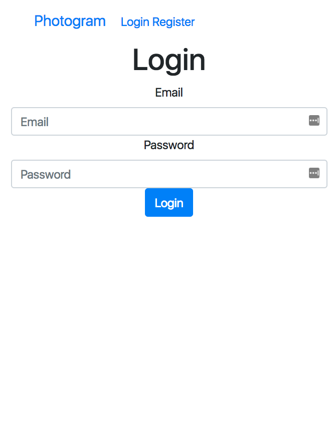

# Photogram

Photogram is an Instagram clone that has been built on Rails 5.
The app is deployed over [here](https://glacial-plains-14125.herokuapp.com/ 'Photogram').

## Features

* Login and Registration Validation
* Post and comment validation
* Login Authorization
* Logout
* Keeps user logged in through sessions
* Functionality restricted only to logged in users
* Each user can only delete his own posts or comments.
* Individual User Accounts
* Image Uploading
* Comment functionality
* Eager Loading to optimize queries
* Only first three comments shown for posts on homepage
* Posts can only be added from user page
* Each post shows the user that submitted it
* Each comment shows the user that made the comment

## Screenshots

### Login Page

### Registration Page

### Registration Page with Validation Errors

### Homepage

### User Page

